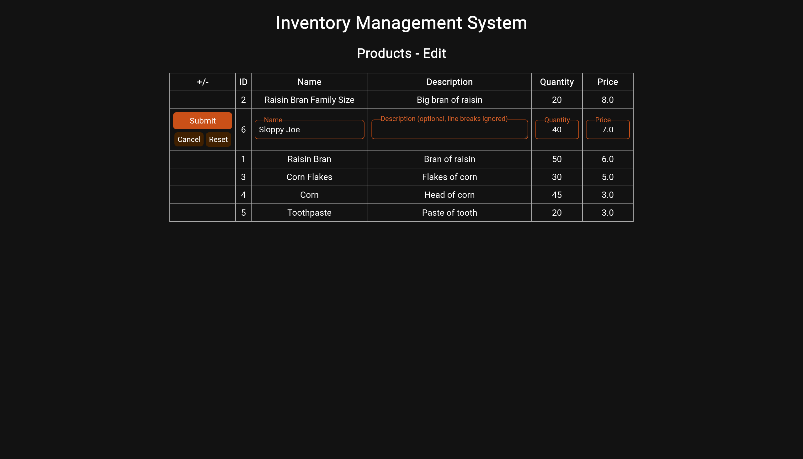

# Inventory Management System

- **University**: University of North Dakota
- **Course**: CSCI 455: Database Management Systems
- **Semester**: Spring 2023
- **Project**: Inventory Management System
- **Group Members**: Daniel De Jesus, Alycia Sloan, Austin Garcia

## Set Up and Run

- Clone the repo
- Switch to the `dev` branch: `git switch dev`
- Install runtime dependencies: `python -m pip install -r requirements.txt`
- Start web server: `python run.py`
- Open home page: Navigate to `localhost:5000` in your browser's URL bar (primarily developed for Firefox with secondary support for Chrome)
- Log in using `admin` for username `0` for password
- Play around

## Set Up and Develop

- Follow the [instructions to set up and run](#set-up-and-run) IMS.
- Install development dependencies (currently includes pre-commit and pytest): `python -m pip install -r requirements-dev.txt`
- Set up [pre-commit](#static-code-analysis-with-pre-commit)
  - A minimal setup would be to only run on push (you can still run manully any time you want): `pre-commit install --hook-type pre-push`
  - After installing, run `pre-commit run --all-files` and make sure everything passes
- Direct changes are only ever made to `dev` and feature branches which get merged into `dev`. Changes are merged into `main` periodically only from `dev`
  - Quick and trivial changes that are well-tested can be pushed directly to `dev` as long as pre-commit passes locally
  - Non-trivial changes should be checked out to a dedicated branch of the form `<username>/<branch-description>`
- Commits are linted for adherence to [Conventional Commits](https://www.conventionalcommits.org/en/v1.0.0/#summary). You may optionally add a helper comment for when you're editing commit messages: `git config commit.template .commit-msg-template`

### Static Code Analysis with pre-commit

[pre-commit](https://pre-commit.com/) is used to automate formatting, detection of errors and bugs, and to enforce general code quality standards. It is set up to run on the remote and can be configured to run locally. pre-commit on your branch must pass all checks before merging into `main`.

To see all hooks configured, see [.pre-commit-config.yaml](.pre-commit-config.yaml)

#### Setup

Decide which stages you want pre-commit to run at:

- Manual (no stages): See [Usage](#usage)
- All stages specified in the config: `pre-commit install`
- pre-commit: `pre-commit install --hook-type pre-commit`
- pre-push: `pre-commit install --hook-type pre-push`
- For other stages, see [confining hooks to run at certain stages](https://pre-commit.com/#confining-hooks-to-run-at-certain-stages) (pre-commit.com)
- To disable hooks for all stages: `pre-commit uninstall`

It's up to you how you want to set this up locally. Some people want regular, frequent feedback from their tools, others just want to go full stream of consciousness and work on their feature without distraction. The best workflow is the one that makes you more productive. However, you will want to run pre-commit at some point before commiting/merging into `dev`.

#### Usage

Depending on which stage(s) you enabled hooks for, pre-commit will run automatically. However, if you chose not to have pre-commit run automatically, the following can be run at any time:

- Run pre-commit on staged changes: `pre-commit`
- Run a specific hook on staged changes: `pre-commit run <hook_id>`
  - Note: If you want to pass extra arguments to the tool, you'll have to install it separately. You shouldn't have to worry about conflicting with pre-commit in doing so as pre-commit runs in an isolated environment with its own binaries. The only thing I might suggest is that you ensure you're using the same version as specified in `.pre-commit-config.yaml` if you're getting unexpected results.
- Run pre-commit on all files, whether or not changes were made: `pre-commit run --all-files`

Handling failures: Any time a pre-commit run fails, the operation you attmpted will be cancelled. You must either resolve the failures or repeat the operation with `--no-verify` or `-n` to ignore them.

## Screenshots

